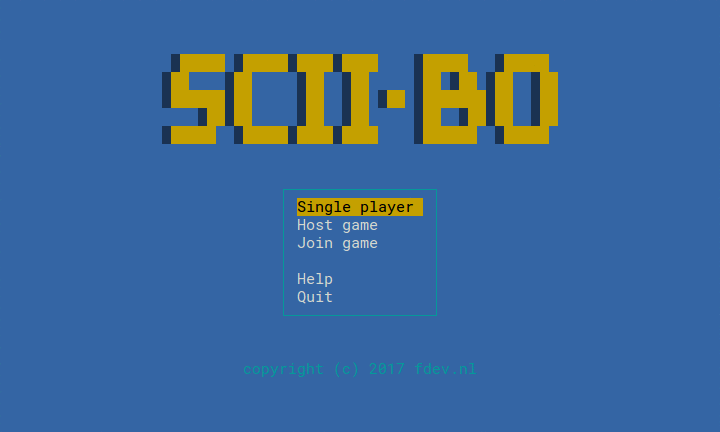
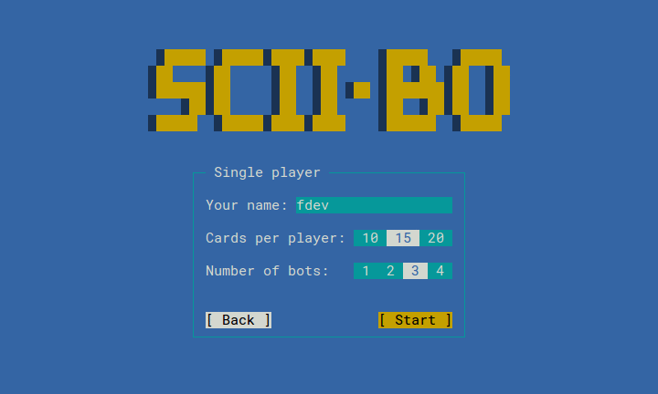

# sciibo

> ASCII version of the classic card game Spite and Malice.

Play this [popular card game](https://en.wikipedia.org/wiki/Spite_and_Malice) game with up to five players against the computer or other players on the local network, _in your terminal!_ Despite being rendered using 80x24 [VT100 terminal](https://en.wikipedia.org/wiki/VT100) characters only, the game features colorful graphics and animations.


## Features

* Up to five players
* Computer opponents (AI)
* Local network opponents
* Network game discovery
* Blocky graphics

|             |      |
| ----------------------------------------------- | ------------------------------------------------- |
|  |  |


## Run the game

Clone the repository and start the main application script.
This game is written in Python and only uses built-in modules, no external dependencies are required. Both Python 2 and 3 are supported.

```sh
git clone https://github.com/fdev/sciibo.git
cd sciibo
python -m sciibo
```

If you have installed the game, you can start it by using the `sciibo` command.

**On Windows:** The Windows version of Python doesn't include the curses module. You can [download](http://www.lfd.uci.edu/~gohlke/pythonlibs/#curses) an unofficial Windows binary and install it using `pip install curses‑2.2‑cp36‑cp36m‑win_amd64.whl`


## How to play

A detailed description on how to play the game is available in the Help section in the game itself. You can also read the Wikipedia article on the game [Spite and Malice](https://en.wikipedia.org/wiki/Spite_and_Malice).


## Installation (optional)

The easiest way to install the game is by using `pip`:

```sh
pip install git+https://github.com/fdev/sciibo
```

If `pip` is not available, the following should work just as well:

```sh
git clone https://github.com/fdev/sciibo.git
cd sciibo
python setup.py install
```

Sudo or root privileges might be required to install the game system-wide.
After installation you can start the game using the command `sciibo`.


## Tests

Some parts of the code are covered by tests, which can be run using the following command:

```sh
python -m unittest discover sciibo
```


## License

This project is licensed under the [MIT License](LICENSE.md).
